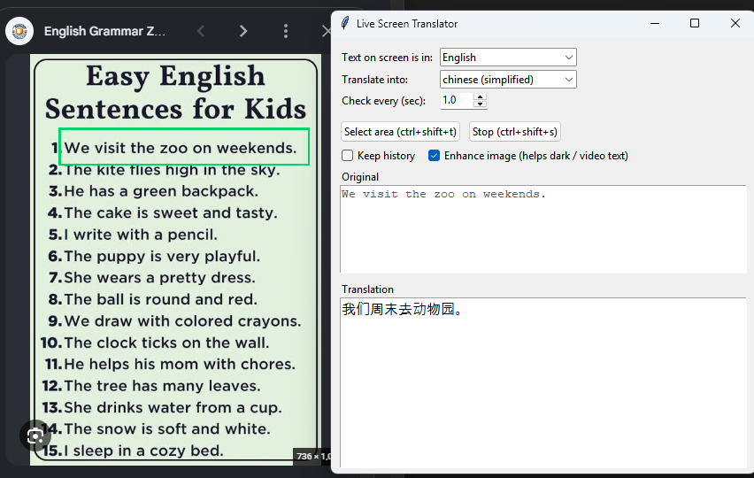

# SnipLingo: A SnapShot-based Live Translator
Select an area of your screen once, and this app keeps reading the text inside it and translating it whenever it changes. Think of it as screen snipping that never stops. It works well for video subtitles, game chat, foreign-language websites and apps.

- **Live**: re-checks the area every second (adjustable) and only translates when the text changes.
- **Offline OCR**: uses the text recognition built into Windows 10/11. There is no Tesseract to install and no OCR API key.
- **Compact mode**: shrink the window to a small always-on-top box that shows only the translated text.
- **Remembers your settings** between runs.



## Requirements

- Windows 10 or 11
- Python 3.9+ (developed and tested with 3.12)
- An internet connection (for translation)
- The **source** language installed in Windows (see [OCR languages](#ocr-languages))

## Install

```bash
git clone https://github.com/RyanCJC/SnipLingo-A-SnapShot-based-Live-Translator.git
cd SnipLingo
python -m venv .venv
.venv\Scripts\activate
pip install -r requirements.txt
```

## Run

```bash
python live_translate.py
```

1. Choose **Text on screen is in** (the source language) and **Translate into** (your language).
2. Click **Select area** (or press `Ctrl+Shift+T`) and drag a box tightly around the text.
3. A green frame stays on screen and translation starts straight away.

## Hotkeys

| Hotkey | Action |
|---|---|
| `Ctrl+Shift+T` | Select a new area |
| `Ctrl+Shift+S` | Pause / resume |
| `Ctrl+Shift+M` | Toggle compact mode |

Hotkeys are global, so they work while another app is focused. If they don't respond, try running the terminal as Administrator.

## Compact mode

Click **Compact** (or press `Ctrl+Shift+M`) to collapse the window into a borderless box that shows only the translation.

- **Drag** the text to move it. **Drag the corner** (◢) to resize.
- **Right-click** for a menu: pause/resume, select a new area, copy, text size, opacity, quit.
- **Double-click** the text, or press `Ctrl+Shift+M` again, to expand back to the full window.
- Errors appear in the box with a ⚠ prefix, so you don't miss them.

## Options

| Setting | What it does |
|---|---|
| Check every (sec) | How often the area is checked (0.3 to 10). Translation only happens when the text actually changes. |
| Keep history | Append each new translation instead of replacing the previous one. Good for chat. |
| Enhance image | Upscales and fixes contrast, and inverts light-on-dark text. Helps with video and dark themes. |

Settings are saved to `%APPDATA%\LiveScreenTranslator\settings.json`.

## Tips

- **Keep the window out of the green box.** Otherwise it reads its own translation. The app shows a red border around the translation text when it detects an overlap.
- Drag the box **tightly** around the text. Less background gives better OCR.
- Video subtitles work best with an interval of 0.5 to 1 second. Slow-changing pages are fine at 2 to 5 seconds.

## OCR languages

Text recognition uses the Windows OCR engine, so the source language has to be installed in Windows:

**Settings → Time & language → Language & region → Add a language**

The dropdown only lists languages that are installed. Add one, restart the app, and it appears.

## Troubleshooting

Run the diagnostic script. It tests screen capture, OCR, installed languages and translation separately and tells you which step fails:

```bash
python diagnose.py
```

| Symptom | Likely cause |
|---|---|
| "No text found in area" | Wrong source language selected, or the box is too loose |
| Source language missing from the list | Language not installed in Windows |
| `TooManyRequests` / "rate limit" | Google temporarily limited your IP. The app pauses 30 s and retries. Increase the interval, or wait. |
| Nothing happens on hotkey | Run the terminal as Administrator |

## How it works

1. Capture the selected area with Pillow (`ImageGrab`).
2. Skip everything if the image hasn't changed.
3. OCR with the Windows engine through [`winocr`](https://github.com/GitHub30/winocr).
4. Skip if the text is ~90% similar to the last result (stops OCR flicker causing re-translations).
5. Translate and show it. Results are cached.

## Limitations

- Windows only, since it relies on Windows OCR.
- Captures the **primary monitor** only.
- Translation uses Google Translate's **unofficial, free web endpoint** (no API key). It is fine for personal use, but it can be rate-limited or change without notice, and it is not suitable for heavy or commercial use. For that, swap `translate()` in `live_translate.py` for an official API such as Google Cloud Translation, DeepL or Azure.
- Text on screen is sent to Google for translation. Don't use it on sensitive content.

## Roadmap

Small, realistic improvements I'd like to make. Nothing here is promised.

- [ ] **Refurbished Frontend**: make the app looks prettier
- [ ] **Multi-monitor support**: select areas on any screen, not just the primary one
- [ ] **Remember the last scan area** so it can be restored on the next launch
- [ ] **Custom hotkeys** in the settings instead of fixed key combinations
- [ ] **Save translations to a file** (copy or export the history as text)
- [ ] **Optional official translation APIs** (for example DeepL or Google Cloud) with your own API key, as a more reliable alternative to the free endpoint
- [ ] **Packaged `.exe`** so Python isn't needed to run it
 
## Contributing

Issues and pull requests are welcome. Ideas: multi-monitor support, a system tray icon, a pluggable translation backend, and a packaged `.exe`.

## License

MIT. See [LICENSE](LICENSE).
